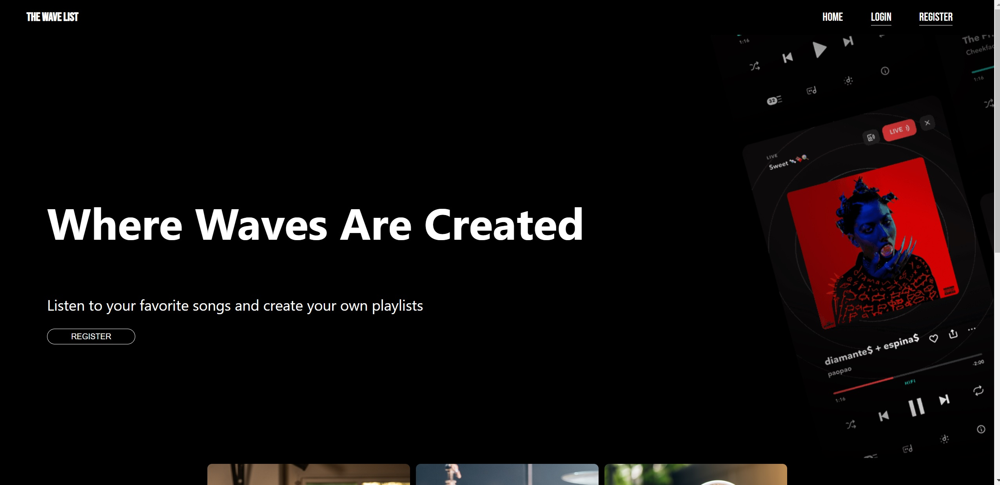
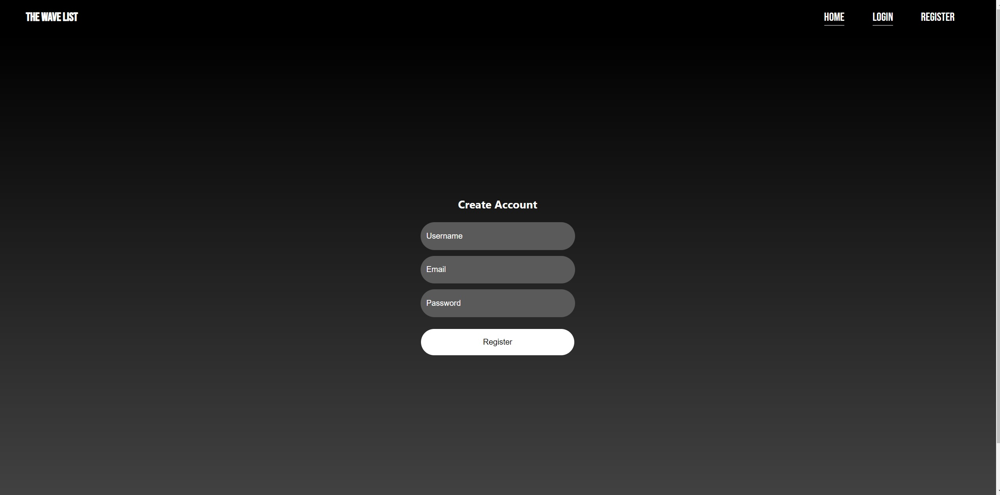
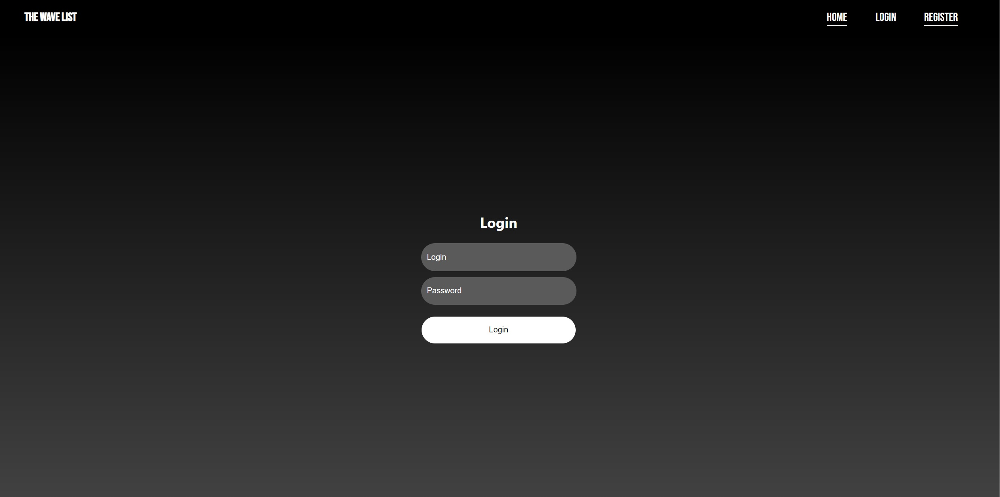
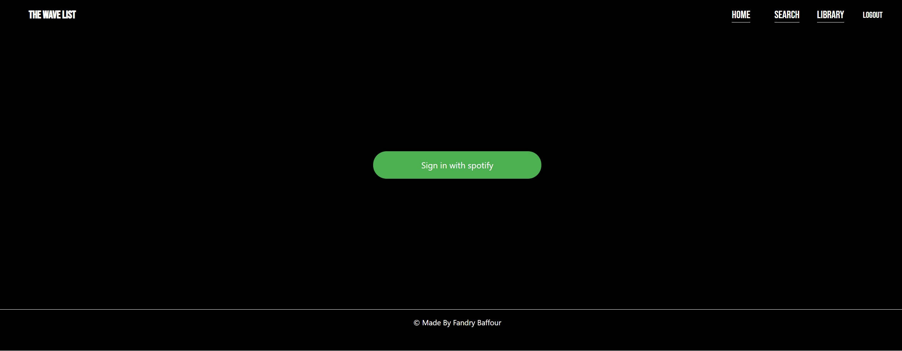
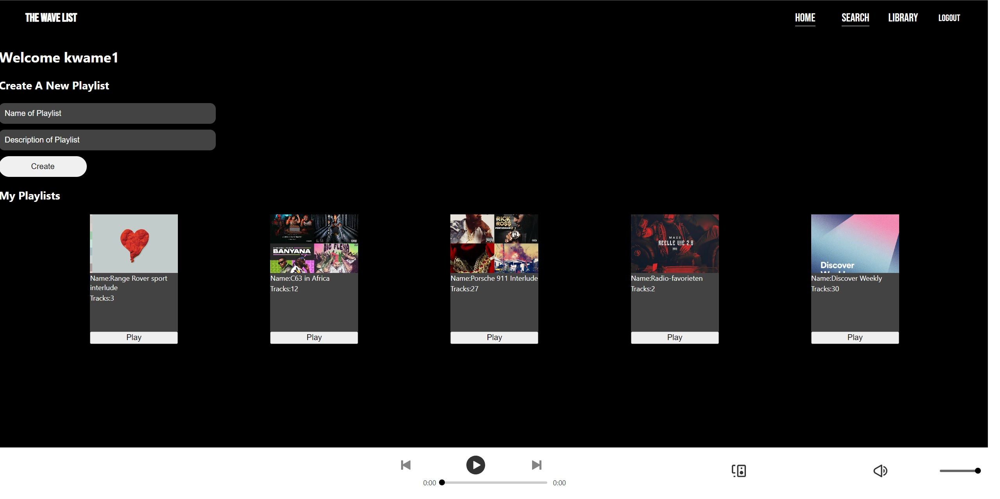
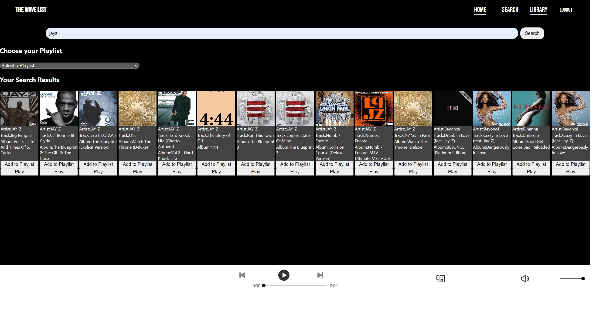

WaveList
=======

Table of Contents
=================

1.  [Installatie]
2.  [Gebruik]
3.  [Demo]

WaveList is een eenvoudige streaming app waarmee je muziek luisteren en Playlisten kan creeren om je favoriete nummers te verzamelen.

1.Installatie
-----------

Om WaveList te installeren, moet je React, Node.js en npm op je machine hebben geïnstalleerd. Kloon dan deze repository en voer `npm install`uit 
om alles te installeren.

2.Gebruik
-------
Stap 1: Om de app te starten, voer je`npm start`uit en open je`http://localhost:3000`in je browser.

Stap 2: Je komt dan op de Home pagina terecht klik op registreren om je te registreren je wordt daarna geredirect naar de Login pagina daar log je in en daarna krijg je 
de Spotify login scherm je kan natuurlijk je eigen Spotify login gebruiken heb je dat niet gebruik de mijne : gebruikersnaam:  en wachtwoord: .

Stap 3: Zodra je bent ingelogd wordt je geredirect naar de Home Page vanuit daar kan je kiezen om gelijk naar de library te gaan om een playlist
aan te maken of naar bestaande playlists luisteren.

Stap 4: Ga naar de Searchpage boven aan zie je een zoekbalk via zoek je favorite nummer op.
daaronder  zie je een drop down menu daar kan je kiezen op welke playlist je een nummer wilt toevoegen.

Stap 5: wanneer je zoekt naar een nummer krijg je onderaan je zoekresultaten je krijgt een image te zien en daar onder 2 buttons
1 voor afspelen en 1 om toe te voegen aan je playlist.

stap 6: onderaan de pagina zie je een speler daar wordt het nummer afgespeelt.

stap 7: ga naar je library page en klik op play bij je playlists.

3.Demo
----
Stap: 1 Hompage.

Stap: 2 registreer.

Stap: 3 Login.

Stap: 4 Login met je spotify Account.

Stap: 5 maak een playlist.

Stap: 6 zoek je favoriete nummer en speel het af en add het aan je playlist.

